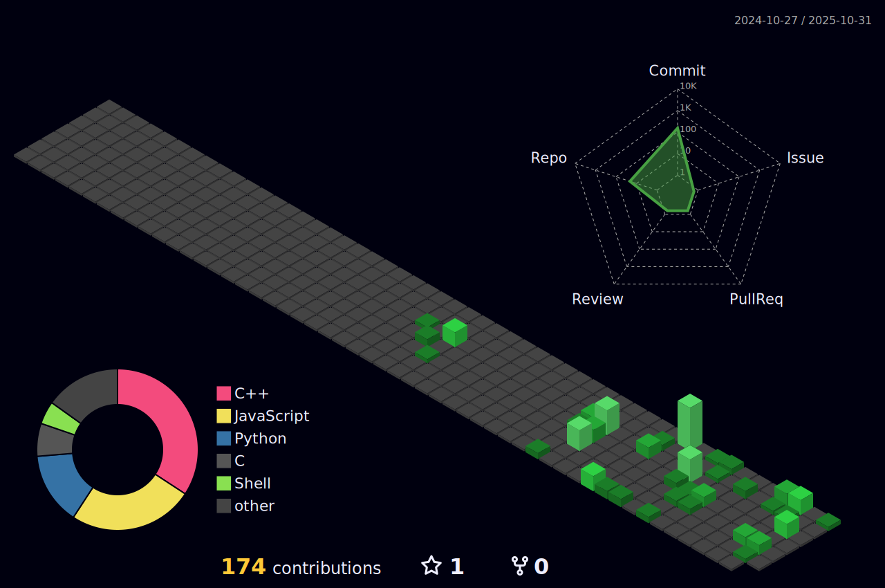

<h1 align="center">🐳 About Me</h1>

###

 

###

Raspberry Pi Expert • Linux Enthusiast • CKA-Certified Kubernetes Administrator IoT Developer • AI Vision Builder • Docker & Self-Hosted Systems Explorer Tech Educator @ Cytron • Advocating Edge Computing, Automation & Open Source

###

<h2 align="center">**My Language & Tools**</h2>

###

  
  
  
  
  
  
  
  
  
  
  
  
  
  
  
  
  
  
  
  
  
  
  
  
  
  
  
  
  
  
  
  
  
  
  
  
  
  
  
  
  
  
  
  
  
  
  
  
  
  
  
  
  
  
  
  
  
  
  
  
  
  
  
  
  

###

###

###

<h2 align="center">**Contact Me**</h2>

###

  
  
  
  

###

  
  

